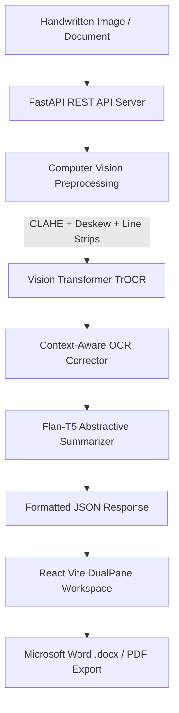

# DocuVision AI (Hand2Text Pro)

**An intelligent end-to-end Neural OCR & NLP platform that transforms complex physical handwritten notes into beautifully structured digital documents and AI-synthesized executive summaries.**

[Key Features](#-key-features) • [System Architecture](#-system-architecture) • [Quick Start](#-quick-start) • [API Documentation](#-api-documentation) • [Demo Credentials](#-demo-access)

---

##  Overview

Physical note-taking remains the predominant capture method during academic lectures, research discussions, and executive brainstorming. However, handwritten notes suffer from searchability limitations, lack of indexing, and manual archiving friction.

**DocuVision AI** bridges this gap by offering:
1. **Neural Line-Level Transcription:** Powered by Vision Transformer (TrOCR) and EasyOCR for robust handwriting recognition even under ruled notebook lines and cursive handwriting.
2. **Context-Aware OCR Post-Correction:** Automated spelling disambiguation, glyph normalization, and punctuation restoration.
3. **Flan-T5 Abstractive Summarization:** Auto-extracts executive summaries, key highlights, action items, and topic tags.
4. **Interactive Dual-Pane Workspace:** Side-by-side verification with synchronized image zooming, real-time rich-text editing, and one-click .docx / .pdf export.

---

##  Key Features

-  **Multi-Stage Image Preprocessing:** Adaptive CLAHE contrast enhancement, Hough transform deskewing, and intelligent ruled notebook line suppression.
-  **Hybrid Vision-Language OCR:** Combines text localization bounding boxes with Transformer Encoder-Decoder sequence transcription.
-  **Abstractive AI Summarizer:** Generates executive briefs and action items utilizing Google's `flan-t5-base`.
-  **Real-Time Dual-Pane Editor:** High-performance React UI featuring synchronized zoom controls and live text customization.
-  **Multi-Format Document Archiving:** Instant export to styled Microsoft Word (`.docx`), PDF, and Plain Text formats.
-  **Secure Access & Firebase Auth:** Role-based access control with built-in instant evaluation access.

---

##  System Architecture

---

##  Tech Stack

| Layer | Technologies |
|---|---|
| **Frontend** | React 18, Vite, Tailwind CSS, Lucide Icons, React Dropzone, React Quill |
| **Backend API** | FastAPI, Uvicorn, Python 3.10+, Pydantic, Python-docx |
| **Machine Learning & NLP** | PyTorch, Hugging Face Transformers (	rocr-base-handwritten, lan-t5-base), EasyOCR, OpenCV (cv2) |
| **Authentication & Storage** | Firebase Authentication & Admin SDK |

---

##  Quick Start

### Prerequisites
- Python 3.10 or higher
- Node.js 18+ and npm
- Git

### 1. Clone the Repository
`ash
git clone https://github.com/YOUR_USERNAME/docuvision-ai.git
cd docuvision-ai
`

### 2. Backend Setup
`ash
# Navigate to backend directory
cd backend

# Install Python dependencies
pip install -r requirements.txt

# Start the FastAPI Server (Port 8000)
python -m uvicorn main:app --host 127.0.0.1 --port 8000 --reload
`
*Backend API will run at http://127.0.0.1:8000 with interactive Swagger Docs at http://127.0.0.1:8000/docs.*

### 3. Frontend Setup
`ash
# Open a new terminal and navigate to frontend directory
cd hand2text-pro

# Install Node dependencies
npm install

# Start Vite Development Server (Port 3000)
npm run dev
`
*Frontend will open automatically at http://localhost:3000.*

---

##  Demo Access

For instant evaluation without setting up external authentication, use the built-in credentials:

| Role | Email | Password |
|---|---|---|
| **Researcher / Evaluator** | ishwa@docuvision.ai | ishwa123 |
| **Administrator** | dmin@docuvision.ai | dmin123 |

---

##  API Documentation

Once the backend is running, explore the full interactive OpenAPI specifications at:
- **Swagger UI:** http://127.0.0.1:8000/docs
- **ReDoc:** http://127.0.0.1:8000/redoc

### Core Endpoints:
- POST /api/transcribe — Upload handwritten image for Neural OCR transcription.
- POST /api/summarize — Generate executive summary, key points, and action items.
- POST /api/export/docx — Generate styled .docx Microsoft Word document.

---

##  Authors & Acknowledgments

- **Developed by:** Vishwa
- **Models:** Microsoft TrOCR, Google Flan-T5, EasyOCR, Hugging Face Transformers.

---

##  License

This project is licensed under the [MIT License](LICENSE).
